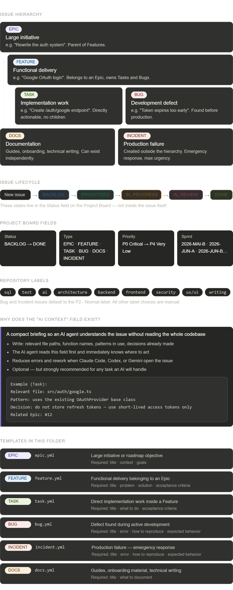

# Issue Templates | Onboarding Guide

Welcome. This guide explains how issues work in this project.

Use it when you are creating issues, organizing work, or starting a session as an AI agent such as Claude Code, Codex, or Gemini Code Assist.

---

## 1. What this folder does

This folder contains the GitHub issue templates used by the project.

When someone creates a new issue, GitHub shows these templates as simple forms. They help keep issues clear, consistent, and easier to work on.

The goal is simple:

- make work easier to understand
- reduce missing context
- help humans and AI agents act faster
- keep the project board organized

There are six templates:

| Template | Use for |
|---|---|
| `epic.yml` | Large initiatives with many related steps |
| `feature.yml` | Functional deliveries with a limited scope |
| `task.yml` | Direct implementation work inside a feature |
| `bug.yml` | Defects found during development |
| `docs.yml` | Documentation, guides, and project history |
| `incident.yml` | Production problems after deployment |

---

## 2. Issue hierarchy

Issues follow a simple hierarchy.

### Epic

A large initiative, roadmap objective, or major project area. Use an Epic when the work is big enough to be split into multiple Features or Tasks.

> Example: *Implement the AI chatbot to analyse user expenses*

### Feature

A functional delivery or product capability. Use a Feature when the work has clear user or product value and can be split into a few Tasks.

> Example: *Create the expense analysis conversation flow*

### Task

Direct implementation or operational work. Use a Task for the actual development steps inside a Feature. Tasks should usually be small, clear, and directly actionable.

> Example: *Implement the OpenAI expense categorization service*

### Bug

A defect found during development before production deployment. Use a Bug when something does not work as expected while the feature is still being built or tested.

> Example: *Token expires too early after login*

### Docs

Documentation work. Use Docs for guides, onboarding material, README updates, technical notes, or historical and context improvements.

> Example: *Document the authentication flow*

### Incident

A production problem found after deployment. Use an Incident when something is already live and affects users, infrastructure, data, or business operations.

> Example: *Login is failing in production*

---

## 3. Project Board fields

Some important fields are managed on the **GitHub Project Board**, not inside the issue template.

After an issue is created, the board is used to set: **Type**, **Status**, **Priority**, and **Sprint**.

### Status

Where the issue is in the workflow:

```
BACKLOG → PRIORITIZED → IN_PROGRESS → IN_REVIEW → DONE
```

### Type

What kind of work the issue represents:

`EPIC` · `FEATURE` · `TASK` · `BUG` · `DOCS` · `INCIDENT`

### Priority

How important or urgent the issue is:

| Value | Meaning |
|---|---|
| `P0 - Critical` | Drop everything |
| `P1 - High` | High urgency |
| `P2 - Normal` | Default priority |
| `P3 - Low` | Nice to have |
| `P4 - Very Low` | Whenever possible |

### Sprint

Which half-month iteration the issue belongs to.

Format: `YYYY-MMM-A` or `YYYY-MMM-B`

- **A** = first half of the month (1st to 15th)
- **B** = second half of the month (16th to end)

Examples: `2026-MAY-B` · `2026-JUN-A` · `2026-JUN-B`

---

## 4. Available labels

Labels describe the **technical area** of an issue. Use them to make filtering, triage, and reporting easier.

| Label | Use for |
|---|---|
| `sql` | Database queries, migrations, and schema changes |
| `test` | Tests, QA, and test infrastructure |
| `ai` | AI features, prompts, agents, and model integrations |
| `architecture` | System design, structure, and technical decisions |
| `backend` | APIs, services, server-side logic, and integrations |
| `frontend` | UI components, client-side logic, and screens |
| `security` | Auth, permissions, vulnerabilities, and hardening |
| `ux/ui` | User experience, interface design, accessibility and design system |
| `writing` | Copy, guides, documentation, and onboarding content |

> Labels describe **technical area**, not workflow. Use the Project Board for Type, Status, Priority, and Sprint. Use labels for the affected part of the system.

---

## 5. The AI Context field

Every template includes an optional **AI Context** field.

This field helps AI agents understand the issue faster. Use it when an issue might be handled by Claude Code, Codex, Gemini Code Assist, ChatGPT, or another AI agent.

A good AI Context gives the agent a short briefing so it does not need to rediscover everything from scratch.

**Good things to include:**

- relevant files
- important functions or classes
- existing patterns
- technical constraints
- decisions already made
- dependencies or services involved

**Example:**

```
Auth flow lives in src/auth/.
JWT signing uses RS256 with the jose library.

Token generation:
  src/auth/token.ts > generateAccessToken()

Config:
  src/config/auth.ts > ACCESS_TOKEN_TTL

Do not change the token payload shape.
It is consumed by the mobile app.
```

The AI Context field is optional, but recommended for any technical issue that might be picked up by an AI agent.

---

## 6. How to create an issue

1. Open the repository on GitHub
2. Go to **Issues**
3. Click **New Issue**
4. Choose the right template
5. Fill in the required fields
6. Add relevant labels if needed
7. Submit the issue — it is automatically added to the Project Board as `BACKLOG`
8. Set **Type**, **Priority**, and **Sprint** on the Project Board

---

## 7. Tips for good issues

**Keep the title clear.**
Prefer *"Google OAuth login fails for new accounts"* over *"Fix OAuth bug."* The title should describe the outcome, not the action.

**One issue, one concern.**
If an issue contains two unrelated problems, split it into two. It makes prioritization and assignment much cleaner.

**Do not overfill optional fields.**
Required fields are the minimum. Optional fields should only be filled when they add real value.

**Use AI Context when useful.**
A few lines of context can save a lot of time when an AI agent picks up the issue later.

**Create Incidents quickly.**
If production is affected, open the Incident first. Details can be added as the investigation progresses, so, do not wait for the full picture.

**Keep Tasks small.**
Tasks should be directly actionable. If a Task grows too large, it probably needs to become a Feature or be split into smaller Tasks.

---

## 8. Visual summary

The image below shows an example of the project structure and settings:


